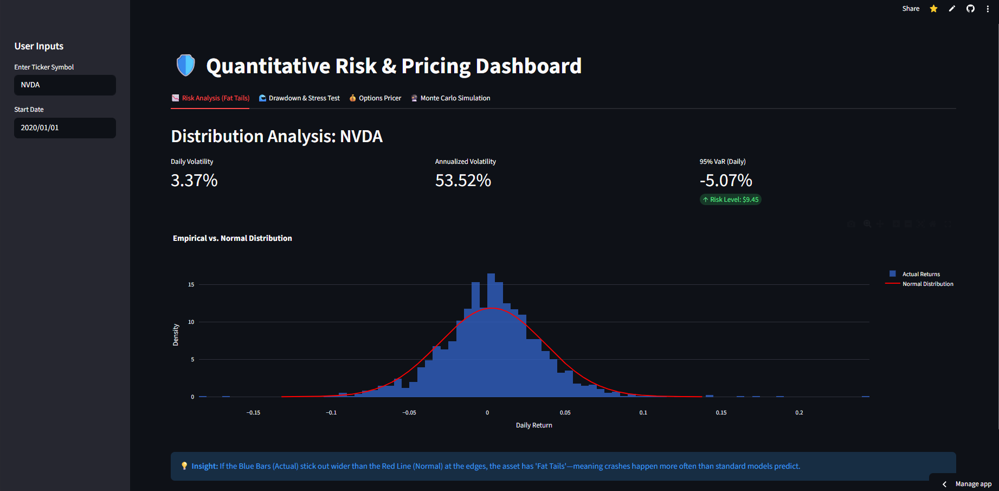
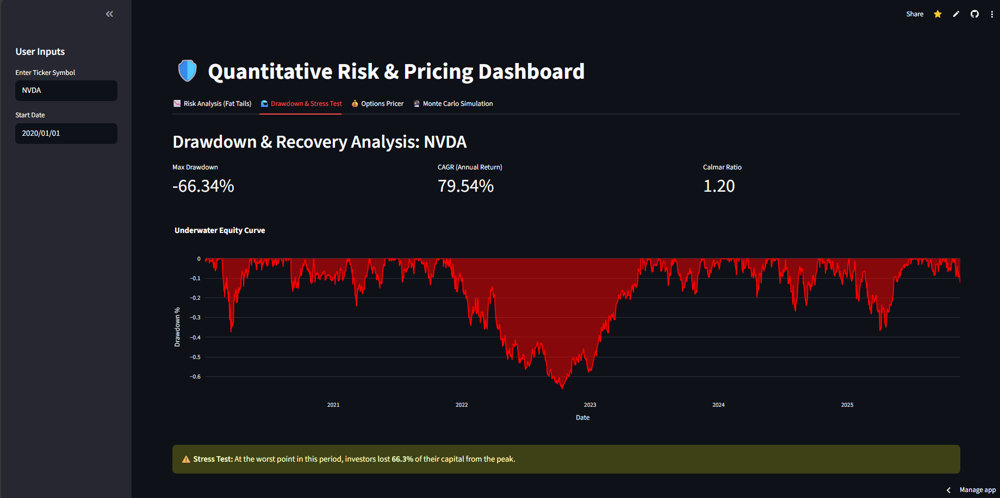
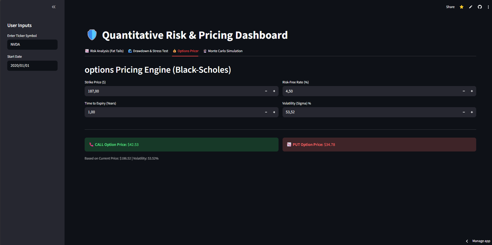
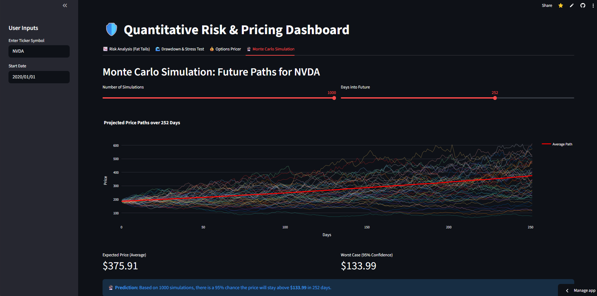

# 🛡️ Quantitative Risk & Pricing Dashboard

[](https://bupponzi-quant-risk-dashboard.streamlit.app)

**Live Demo:** [Click Here to Launch App](https://bupponzi-quant-risk-dashboard.streamlit.app)

## 🚀 Project Overview
**Objective:** To bridge the gap between static financial analysis and real-time risk decision-making. This Full-Stack application ingests live market data to perform institutional-grade risk assessments on any publicly traded asset.

**The Problem:** Retail traders focus on returns. Institutional Risk Managers focus on **Tail Risk**, **Drawdowns**, and **Volatility Pricing**. Standard tools rarely visualize these hidden dangers effectively.

**The Solution:** An interactive engine that audits asset behavior against Gaussian assumptions, stress-tests historical performance, and prices derivatives in real-time.

---

## 📉 Feature 1: Fat Tail Risk Auditor
*Validates the "Normality" of asset returns to detect Black Swan potential.*

* **Metric:** Daily & Annualized Volatility, 95% Value at Risk (VaR).
* **Visualization:** Overlays empirical returns (Histogram) against a theoretical Gaussian distribution (Red Line).
* **Insight:** Visually identifies **Leptokurtosis** (Fat Tails), proving that extreme crash events occur far more frequently than standard models predict.



---

## 🌊 Feature 2: Historical Stress Tester
*Quantifies capital preservation capabilities during market crises.*

* **Metric:** Maximum Drawdown (MaxDD) & Calmar Ratio.
* **Visualization:** "Underwater Equity Curve" highlighting bear market thresholds (-20%).
* **Insight:** Demonstrates the "Pain Threshold" of holding an asset. For example, comparing Bitcoin's -76% drawdown vs. Gold's -20% drawdown to assess suitability for conservative portfolios.



---

## 💰 Feature 3: Derivatives Pricing Engine
*Calculates the fair value of optionality based on real-time volatility.*

* **Model:** Black-Scholes-Merton (Analytic Solution).
* **Inputs:** Dynamic strike prices, risk-free rates (Treasury Yields), and implied volatility.
* **Insight:** Allows traders to identify mispriced option premiums by comparing market prices to theoretical fair value.



---

## 🔮 Feature 4: Stochastic Forecasting (Monte Carlo)
*Simulates thousands of future market regimes to probability-weight outcomes.*

* **Method:** Geometric Brownian Motion (GBM) simulation.
* **Scale:** Runs 1,000+ simulations instantly using vectorized NumPy arrays.
* **Insight:** Generates a 95% Confidence Interval for future price action, moving beyond simple point-estimates to probabilistic forecasting.



---

## 💻 Tech Stack
* **Core Logic:** Python (NumPy, SciPy, Pandas)
* **Data Feed:** YFinance API (Real-time market data)
* **Visualization:** Plotly (Interactive, hover-able charts)
* **Deployment:** Streamlit Cloud (CI/CD from GitHub)

## 🏃‍♂️ How to Run Locally
1.  Clone the repository:
    ```bash
    git clone [https://github.com/YOUR_USERNAME/quant-risk-dashboard.git](https://github.com/YOUR_USERNAME/quant-risk-dashboard.git)
    ```
2.  Install requirements:
    ```bash
    pip install -r requirements.txt
    ```
3.  Launch the dashboard:
    ```bash
    streamlit run app.py
    ```